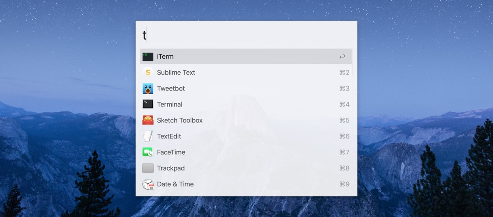

## Sublime Text

- [User settings](Preferences.sublime-settings)

## Alfred

#### Workflows

- [caniuse](https://github.com/willfarrell/alfred-caniuse-workflow)
- [GitHub](http://gordonfontenot.com)
- [IP Address](https://github.com/zenorocha/alfred-workflows/tree/master/ip-address)
- tbsearch
- [Toggler Wifi](https://www.dropbox.com/s/6uy61eg8x2ayrzj/Toggler%20Wifi.alfredworkflow)

#### Theme

I use my own custom theme called “Wynton”—found in this repo—which features a
mostly white UI with a slightly transparent background
and Apple’s San Francisco typeface.

